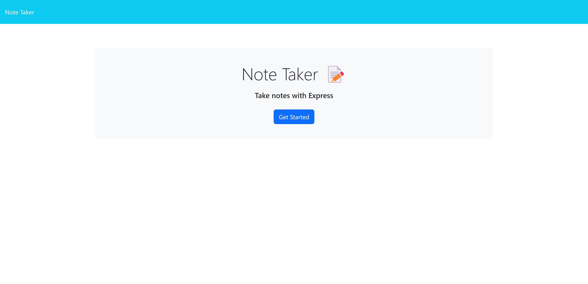
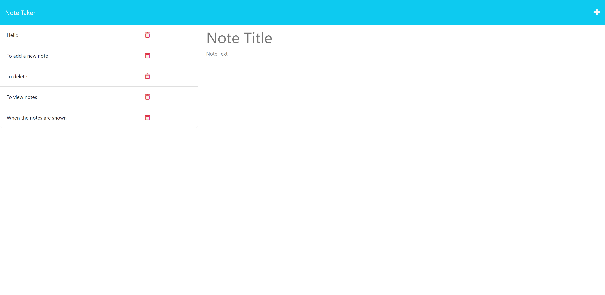
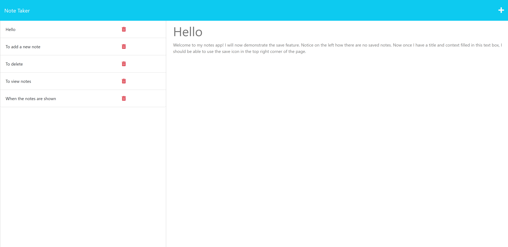

# Express.js-Note-Taker

## Description
The Express.js Note Taker is a server-side application designed to showcase server setup and implementation skills, specifically focusing on using Express.js. It demonstrates the creation of routes for handling post, fetch, and get requests, along with their corresponding paths and responses. The application also includes functionality for modifying saved items by destructuring user responses and stringifying them for storage in a JSON file (db.json). This project provided an opportunity to dive into the Express.js skill set while building a useful note-taking application.

## Table of Contents
- [Installation](#installation)
- [Usage](#usage)
- [License](#license)
- [Contributions](#contributions)
- [Tests](#tests)
- [Questions](#questions)

## Installation
To deploy this code locally, follow these steps:
1. Clone the repository by visiting the [GitHub repository](https://github.com/rocas3096/Express.js-Note-Taker) and copying the repository's link.
2. Open Git Bash and navigate to the directory where you want to clone the code.
3. Type `git clone` followed by the copied link and press Enter.
4. Navigate into the cloned directory.
5. Install the required dependencies by typing `npm install` in the terminal.
6. Start the server by running `npm start` in the terminal.
7. Once the server is running, you will see a message in the terminal indicating that the app is listening at `http://localhost:${PORT}`.
8. Open a web browser and click on the link provided in the terminal to access the application.

## Usage
To use the Express.js Note Taker:
1. Type `npm start` in the terminal to start the server.
2. Once the server is running, open the application in your web browser by clicking the link displayed in the terminal.
3. Click on the "Get Started" button to begin using the note taker.
4. Enter a title and note content in the respective fields.
5. Click the "Save" button to save the note.
6. The saved note will appear on the left-hand side, and you can view its content by clicking on the note's title.
7. To delete a note, click the small trash can icon next to the note.
8. You can also try the [deployed version of the application on Heroku](https://still-reef-21653.herokuapp.com/).

A demo video is available to demonstrate the functionality: [Demo of Note Taker](https://drive.google.com/uc?id=1_c1tNxR7CS5auEFcTuyO1txj6EnZX9h0)

## License
This project is licensed under the MIT License.

## Contributions
Starter Code by Xandromus [https://github.com/coding-boot-camp/miniature-eureka]

Contributions to this project are welcome. To contribute, please follow these steps:
1. Follow the installation instructions to set up the project locally.
2. Create a feature branch with your name as the branch name.
3. Make your desired changes in the feature branch.
4. Commit your changes and push the branch to the remote repository.
5. Submit a pull request, and your changes will be reviewed for merging into the main branch.

## Tests
No tests have been deployed for this project at this time.

## Questions
If you have any questions, feel free to reach out:

GitHub Profile: [Oscar Zavala](https://github.com/rocas3096)

GitHub Username: rocas3096

Email: ozavala3096@gmail.com
